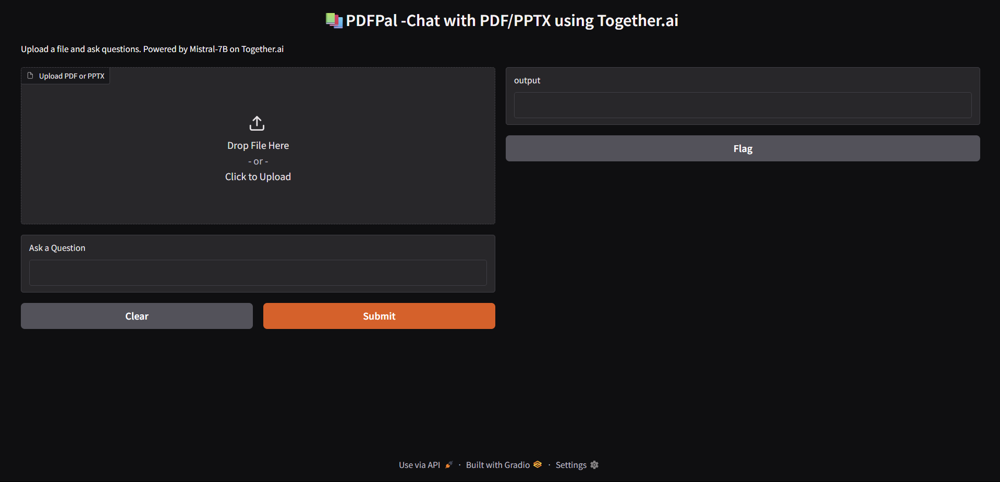
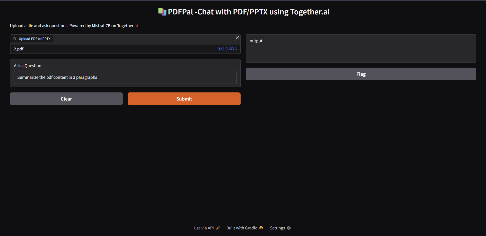
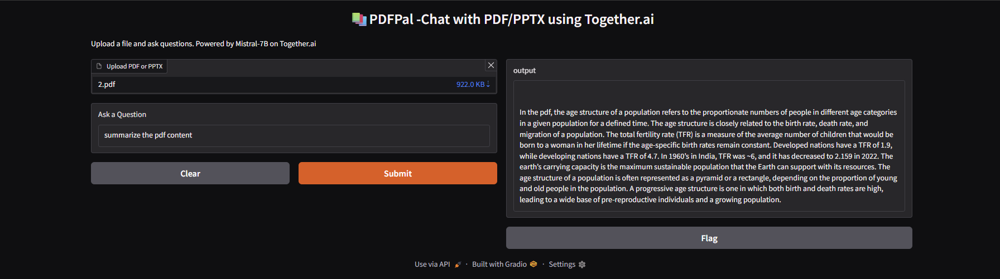

# 📚 PDFPal – Chat with PDF & PPTX using Generative AI

PDFPal is a Generative AI-based application that allows users to **ask questions** from uploaded **PDF or PPTX files**. Built using **LangChain**, **FAISS**, **HuggingFace Embeddings**, and **Together.ai's Mistral-7B model**, the app provides meaningful, context-aware answers extracted from document content. The user interface is powered by **Gradio**.

---

## 🚀 Features

- ✅ Upload PDF or PPTX files
- ✅ Extracts and chunks document content
- ✅ Generates embeddings using HuggingFace
- ✅ Stores chunks in a FAISS vector database
- ✅ Uses Together.ai's LLM (Mistral-7B) for answering questions
- ✅ Clean and easy-to-use Gradio UI

---

## 🖼️ UI Screenshots

Here are some screenshots demonstrating how the app works from start to finish:

---

### 📌 1. Initial Interface  
The user sees a clean Gradio UI with the option to upload a PDF or PPTX file and a textbox to enter their question.



---

### 📂 2. After Upload & Question Input  
Once a file is uploaded and a question is typed, the system prepares to process the input and generate a response.



---

### 📢 3. Answer Displayed  
The model returns a relevant answer extracted from the uploaded document. The result is displayed in a clear and readable format.



---

> 🧠 These screenshots demonstrate the seamless flow and usefulness of the app — from document upload to real-time, AI-powered answers!

---
## 🛠️ Tech Stack

- **Python 3.10+**
- [LangChain](https://python.langchain.com/)
- [FAISS (Facebook AI Similarity Search)](https://github.com/facebookresearch/faiss)
- [HuggingFace Transformers](https://huggingface.co/)
- [Together.ai API](https://platform.together.xyz/)
- [Gradio](https://www.gradio.app/)

---

## 📦 Installation

1. **Clone the repository**  
   ```bash
   git clone https://github.com/your-username/pdfpal-genai.git
   cd pdfpal-genai
  

## 2. **Install Dependencies**

Make sure you are using **Python 3.10+**.

Install all required libraries using the following command:

```bash
pip install langchain langchain-community langchainhub pypdf2 python-pptx gradio together
```

### 4. **Run the App**

To start the application, simply run the `main.py` script using Python:

```bash
python main.py
```

When prompted, enter your Together.ai API Key in the terminal:
```bash
Enter Together.ai API Key: █████████████
```
Once the key is entered, the Gradio interface will automatically launch in your browser.

## 📚 How to Use the App

Once the app is running, follow these steps:

1. **Upload a Document**  
   - Click **“Upload PDF or PPTX”** in the Gradio interface  
   - Drag & drop or browse to select a `.pdf` or `.pptx` file  

2. **Ask Your Question**  
   - Type your question in the **“Ask a Question”** textbox  
   - Example:  
     > "What is the summary of this presentation?"  
     > "List the key points from slide 5."

3. **Get Real-Time Answers**  
   - Click **Submit**  
   - The app will extract text, perform semantic search, and generate a contextual answer using **Together.ai's Mistral-7B model**  
   - The answer will appear below the input box in seconds

⚡ That's it! You now have an AI-powered assistant for reading and interacting with documents.

---

## 📄 License

This project is licensed under the **MIT License** – see the [LICENSE](LICENSE) file for details.

---

## ❤️ Made with Love

Made with ❤️ by **Souhardya**  
Feel free to connect, contribute, or fork this project!

